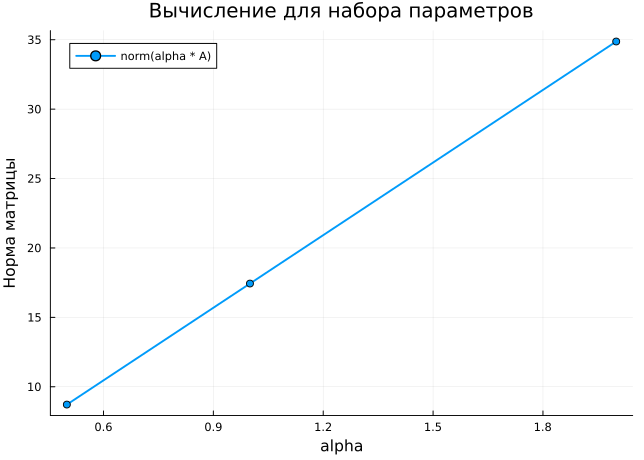

---
## Author
author:
  name: Ведьмина Александра Сергеевна
  degrees: student
  email: 1132236003@rudn.ru
  affiliation:
    - name: Российский университет дружбы народов
      country: Российская Федерация
      postal-code: 117198
      city: Москва
      address: ул. Миклухо-Маклая, д. 6

## Title
title: "Компьютерный практикум по статистическому анализу данных"
subtitle: "Лабораторная работа №1. Julia: установка, настройка и основные принципы"
license: "CC BY"
---

# Цель работы

Подготовить рабочее пространство и инструментарий для работы с языком
программирования Julia, освоить работу с Julia в Jupyter Lab и на простейших
примерах познакомиться с базовым синтаксисом языка.

# Задание

В ходе лабораторной работы требовалось:

1. установить Julia и Jupyter Lab, подключить ядро IJulia;
2. создать воспроизводимый вычислительный проект в структуре `DrWatson`;
3. повторить примеры определения типов, преобразования значений, функций,
   векторов и матриц;
4. изучить функции ввода-вывода `read`, `readline`, `readlines`, `readdlm`,
   `print`, `println`, `show` и `write`;
5. изучить функцию `parse` и безопасное преобразование `tryparse`;
6. выполнить примеры математических, сравнительных и логических операций;
7. выполнить операции над векторами и матрицами;
8. провести расчёт для нескольких значений параметра, сохранить результаты и
   построить график;
9. получить из единого literate-источника исполняемый Julia-файл, notebook и
   Quarto-документ;
10. проверить проект автоматическими тестами.

# Теоретическое введение

## Язык Julia и интерактивные вычисления

Julia является высокоуровневым языком программирования, ориентированным на
численные и научные вычисления. Язык поддерживает динамическую диспетчеризацию,
параметрические типы, эффективные массивы и непосредственную работу с
математическими выражениями [@julia-docs].

Jupyter Lab организует работу в виде notebook-документа, объединяющего текст,
программный код, результаты выполнения и визуализации. Пакет `IJulia`
регистрирует Julia как доступное ядро Jupyter [@ijulia-docs; @jupyter-docs].

## Типы и преобразование данных

Функция `typeof` возвращает тип значения. Для целочисленных типов функции
`typemin` и `typemax` задают границы представимого диапазона. Значения `Inf`,
`-Inf` и `NaN` имеют вещественный тип и используются для представления
бесконечности и неопределённого результата.

Преобразование данных выполняется конструктором требуемого типа или функцией
`convert`. Функция `promote` приводит несколько значений к общему типу, если
такое преобразование возможно. Функция `parse` преобразует строку в заданный
тип, а `tryparse` вместо исключения возвращает `nothing` при некорректном вводе.

## Векторы и матрицы

Одномерный массив Julia задаёт вектор, а двумерный --- матрицу. Индексация
начинается с единицы. Оператор `*` реализует матричное умножение, `.*` ---
поэлементное, апостроф выполняет сопряжённое транспонирование, а функция `dot`
вычисляет скалярное произведение.

В параметрической части работы для матрицы $A$, вектора $v$ и параметра
$\alpha$ вычислялись

$$
A_{\alpha}=\alpha A, \qquad
r_{\alpha}=A_{\alpha}v, \qquad
n_{\alpha}=\lVert A_{\alpha}\rVert_F.
$$

## Воспроизводимый проект

Пакет `DrWatson` предоставляет стандартные каталоги для кода, данных и
графиков и позволяет получать пути независимо от текущего рабочего каталога
[@drwatson-docs]. Пакет `Literate` создаёт из одного комментированного Julia-
файла чистый сценарий, Jupyter Notebook и документ Quarto
[@literate-docs; @quarto-docs]. Фиксация зависимостей в `Project.toml` и
`Manifest.toml` обеспечивает повторяемость программного окружения.

# Выполнение лабораторной работы

## Подготовка рабочего окружения

Сначала была проверена установленная версия Julia. В работе использовалась
Julia `1.12.5` (@fig-julia-version).

{#fig-julia-version width=94%}

Jupyter Lab был установлен в отдельное Python-окружение, после чего это
окружение было активировано в терминале (@fig-jupyter-install).

{#fig-jupyter-install width=88%}

Пакет `IJulia` был связан с установленным Jupyter. Команда `jupyter kernelspec
list` подтвердила наличие ядра Julia (@fig-kernels).

{#fig-kernels width=94%}

## Создание проекта `DrWatson`

Проект был создан программно функцией `initialize_project`. В результате
появились `Project.toml`, `Manifest.toml` и стандартные каталоги `data`, `src`,
`scripts`, `plots`, `notebooks` и `test` (@fig-project-init).

{#fig-project-init width=84%}

Сценарий `setup_project.jl` сделан идемпотентным: повторный запуск обнаруживает
существующий проект и не перезаписывает пользовательские файлы
(@fig-project-repeat).

{#fig-project-repeat width=94%}

Зависимости проекта были установлены с помощью `Pkg`. Для медленного соединения
в загрузчике был увеличен допустимый интервал отсутствия передачи данных, а
`IJulia` настроена на системный Jupyter.

## Проверка пакетов

Сценарий `scripts/test_setup.jl` проверяет пути проекта и загрузку всех
требуемых пакетов: `DrWatson`, `DifferentialEquations`, `Plots`, `DataFrames`,
`CSV`, `JLD2`, `Literate`, `IJulia`, `BenchmarkTools` и `Quarto`
(@fig-setup-test).

{#fig-setup-test width=94%}

## Реализация базовых примеров Julia

Основной файл `scripts/lab01_literate.jl` является одновременно исполняемым
сценарием и источником документации. В нём определяются типы чисел, специальные
вещественные значения и границы целочисленных диапазонов:

```julia
values = (3, 3.5, 3 / 3.5, 3 + 4im, pi)
for value in values
    println(repr(value), " имеет тип ", typeof(value))
end

for T in [Int8, Int16, Int32, Int64, Int128,
          UInt8, UInt16, UInt32, UInt64, UInt128]
    println(
        lpad(string(T), 7),
        ": [", typemin(T), ", ",
        typemax(T), "]",
    )
end
```

Преобразование типов и два способа определения функций реализованы следующим
образом:

```julia
direct_conversion = (
    Int64(2.0), Char(65),
)
generic_conversion = (
    convert(Int64, 2.0),
    convert(Char, 65),
)
promoted = promote(Int8(1), Float16(4.5), Float32(4.1))

function square(x)
    return x^2
end
cube(x) = x^3
```

Фрагмент вывода сценария с типами, диапазонами и преобразованиями представлен
ниже (@fig-types).

{#fig-types width=82%}

## Ввод, вывод и преобразование строк

Для демонстрации файлового ввода-вывода были созданы текстовый, бинарный и
табличный файлы. Рассмотрены чтение всего файла, одной строки и массива строк,
а также запись байтов и таблицы:

```julia
whole_text = read(text_file, String)
open(text_file, "r") do io
    println("Результат readline: ", readline(io))
end
all_lines = readlines(text_file)
bytes = UInt8[
    0x41, 0x42, 0x43, 0x0a,
]
bytes_written = write(binary_file, bytes)
writedlm(table_file, numeric_table, ',')
table_from_file = readdlm(table_file, ',', Float64)
```

Функции `print`, `println` и `show` были сопоставлены по формату вывода.
Преобразование строк проверено на целых, вещественных и логических значениях,
а также на числах с основаниями `2` и `16`:

```julia
parse(Int, "42")
parse(Float64, "3.1415")
parse(Bool, "true")
parse(Int, "1010"; base=2)
parse(Int, "ff"; base=16)
tryparse(Int, "abc")
```

## Математические операции и массивы

Проверены сложение, вычитание, умножение, обычное и целочисленное деление,
остаток, степень, квадратный корень, сравнения и логические операции. Отдельно
выполнены операции с векторами и матрицами:

```julia
v + w
v - w
dot(v, w)
transpose(v)
2 .* v
A + B
A - B
A * v
A * B
A .* B
```

## Параметрический расчёт

Вычислительная функция вынесена в `src/lab01.jl` и возвращает параметр, норму
масштабированной матрицы и полученный вектор:

```julia
function calculate_for_parameter(alpha, matrix, vector)
    scaled_matrix = alpha .* matrix
    result_vector = scaled_matrix * vector
    return (
        alpha=alpha,
        matrix_norm=norm(scaled_matrix),
        result=result_vector,
    )
end
```

Расчёт проведён для $\alpha \in \{0.5, 1.0, 2.0\}$. Результаты сохранены в
двух файлах:

- `parameter_results.csv` в каталоге `data/exp_pro`;
- `parameter_results.jld2` в каталоге `data/sims`.

Итоговый вывод сценария представлен ниже (@fig-calculation).

{#fig-calculation width=82%}

Дополнительно решена задача Коши

$$
\frac{du}{dt}=-u, \qquad u(0)=1,
$$

с помощью `DifferentialEquations.jl`. Полученные значения совпадают с
аналитическим решением $u(t)=e^{-t}$ в пределах численной точности.

## Генерация производных форматов

Сценарий `scripts/generate_outputs.jl` сформировал три представления работы:

- `generated/lab01_code.jl` --- чистый исполняемый код;
- `generated/lab01_notebook.ipynb` --- исполненный Jupyter Notebook;
- `generated/lab01_quarto.qmd` --- документ Quarto.

Запуск генератора представлен ниже (@fig-generation).

{#fig-generation width=88%}

Quarto последовательно выполнил все `18` кодовых ячеек и сформировал
самодостаточный HTML-документ (@fig-quarto).

{#fig-quarto width=76%}

Notebook был открыт в Jupyter Lab. Начальная и заключительная части
выполненного документа представлены отдельно: @fig-notebook-begin и
@fig-notebook-end.

{#fig-notebook-begin width=94%}

{#fig-notebook-end width=94%}

## Автоматические тесты

Тесты проверяют три численных результата функции
`calculate_for_parameter` и четыре элемента структуры проекта. Все семь
проверок завершились успешно (@fig-tests).

{#fig-tests width=94%}

# Результаты

## Численные результаты

Сводные результаты параметрического расчёта представлены ниже
(@tbl-parameters).

| $\alpha$ | $\lVert \alpha A\rVert_F$ | Первый элемент | Второй элемент | Третий элемент |
|---:|---:|---:|---:|---:|
| 0,5 | 8,7178 | 7,0 | 16,0 | 26,5 |
| 1,0 | 17,4356 | 14,0 | 32,0 | 53,0 |
| 2,0 | 34,8712 | 28,0 | 64,0 | 106,0 |

: Результаты вычисления $\alpha A v$ {#tbl-parameters}

Линейная зависимость нормы матрицы от $\alpha$ представлена ниже
(@fig-parameter-plot). При удвоении параметра с `1,0` до `2,0` норма и каждый
элемент результирующего вектора также удваиваются.

{#fig-parameter-plot width=78%}

## Результаты решения ОДУ

Для моментов времени от `0` до `5` с шагом `1` получены значения:

| $t$ | Численное значение $u(t)$ |
|---:|---:|
| 0 | 1,000000 |
| 1 | 0,367880 |
| 2 | 0,135336 |
| 3 | 0,049788 |
| 4 | 0,018315 |
| 5 | 0,006739 |

: Численное решение уравнения $u'=-u$ {#tbl-ode}

## Полученные артефакты

По результатам работы сформированы:

- воспроизводимое окружение `Project.toml` и `Manifest.toml`;
- literate-источник и отдельный вычислительный модуль;
- выполненный notebook без ошибочных ячеек;
- чистый Julia-сценарий и Quarto-документ;
- CSV-таблица, JLD2-файл и PNG-график;
- автоматические тесты вычислений и структуры проекта.

# Обсуждение результатов

Все задания лабораторной работы воспроизведены в едином сценарии. Использование
`DrWatson` исключает жёсткое задание относительных путей, а `Manifest.toml`
фиксирует конкретные версии зависимостей. Literate-подход устраняет расхождение
между кодом в notebook и кодом, запускаемым из терминала: оба представления
получены из одного исходника.

Параметрический эксперимент подтверждает свойства умножения матрицы на скаляр:
при положительном $\alpha$ норма Фробениуса и результирующий вектор изменяются
линейно. Решение тестового ОДУ соответствует экспоненциальному убыванию.
Повторный запуск сценария перезаписывает только производные результаты и потому
не требует ручной очистки проекта.

# Заключение

В ходе лабораторной работы:

1. установлены и настроены Julia, Jupyter Lab и IJulia;
2. создан воспроизводимый проект `DrWatson` и установлены необходимые пакеты;
3. изучены базовые типы, преобразования, функции, ввод-вывод и операции с
   массивами;
4. реализован параметрический расчёт с сохранением данных и построением графика;
5. решён пример обыкновенного дифференциального уравнения;
6. из одного literate-источника получены Julia-код, notebook и Quarto-документ;
7. все `18` ячеек notebook выполнены без ошибок, а все `7` автоматических
   тестов пройдены.

Таким образом, цель работы достигнута: рабочее окружение подготовлено, основные
конструкции Julia изучены на выполненных примерах, а результаты оформлены в
воспроизводимом вычислительном проекте.

# Список литературы {.unnumbered}

::: {#refs}
:::
